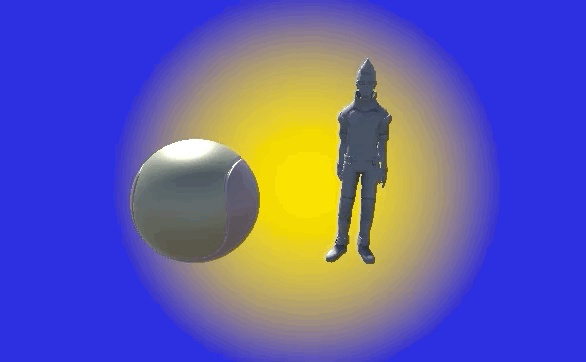
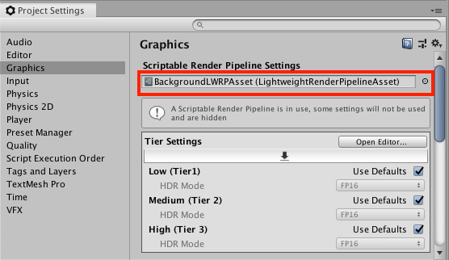
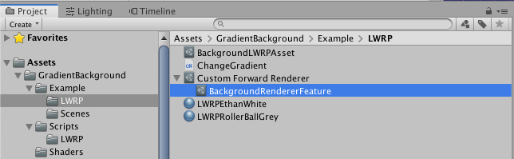
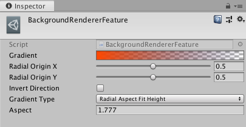

# UnityGradientBackground

Get a beautiful background gradient just by adding a simple script to your camera!

## Features
+ Supports horizontal, vertical and radial gradients
+ Supports up to 6 colors
+ Multiple radial ratio policies
+ Invert direction
+ Custom radial origin
+ Editor preview

## Performance
+ Background is rendered after opaque objects to avoid unnecessary overdraw
+ Optimized shaders that avoid dynamic if conditions
+ Option to "bake" the background texture, thereby exchanging memory for performance

## Instructions

1. Import the `Packages/GradientBackground` to your project
2. Add the `GradientBackground` component to your camera.

## LWRP (Light Weight Render Pipeline support)

Open "Project Settings" and "Graphics" setting.
Set "Scriptable Render Pipeline Settings" property to "BackgroundLWRPAsset", created for this script.

Open LWRPBackgroundGradientExampleScene and press Play button.

### Gradient Setting

To customize gradient setting, at first open "BackgroundRendererFeature" scriptable object in project window.

And at inspector window, adjust properties.

### Scripting

If you want change gradient setting from script, change properties on "BackgroundRendererFeature" scriptable object from script.

Please refer ChangeGradient.cs

